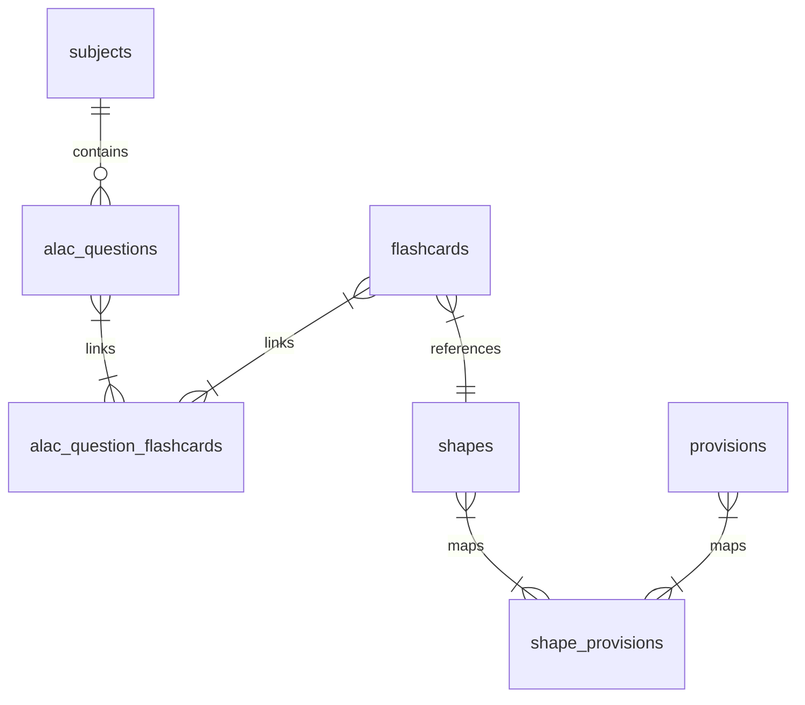

# Disguised ALAC Questions & Flashcard Correlation Design

## 1. Goal
Decouple the ALAC practice questions from the exact flashcard text. Instead of practicing on raw flashcard shape texts, users will practice writing ALAC answers for realistic, disguised bar-exam-style questions. These questions can link to one or more flashcards, which act as hints (concept triggers) and provide the combined model answer key and evaluation criteria.

## 2. Architecture & Data Model

We introduce a many-to-many relationship between ALAC questions and flashcards.



### Database Updates (`schema.sql` & `db.js`)
We will add two tables:
1. `alac_questions`: Stores the disguised question text.
2. `alac_question_flashcards`: Many-to-many junction table to link questions to flashcards.

```sql
CREATE TABLE IF NOT EXISTS alac_questions (
  id TEXT PRIMARY KEY,
  subject_id TEXT REFERENCES subjects(id) ON DELETE CASCADE,
  question_text TEXT NOT NULL,
  created_at TIMESTAMP DEFAULT CURRENT_TIMESTAMP
);

CREATE TABLE IF NOT EXISTS alac_question_flashcards (
  alac_question_id TEXT REFERENCES alac_questions(id) ON DELETE CASCADE,
  flashcard_id TEXT REFERENCES flashcards(id) ON DELETE CASCADE,
  PRIMARY KEY (alac_question_id, flashcard_id)
);
```

---

## 3. Pipeline & Markdown Parser Ingestion

We will modify [parser.js](file:///home/user/Documents/LAW%20BAR/parser.js) to detect a new section `### ALAC QUESTIONS` at the end of subject files.

### Markdown Ingestion Syntax
```markdown
### ALAC QUESTIONS

QUESTION civil-alac-1
SUBJECT: civil-law
QUESTION_TEXT: On June 1, 2026, Arthur sold his registered residential land to Beatrice. Beatrice did not register the sale. On June 5, 2026, Arthur sold the same land to Charlie, who immediately registered the deed of sale in good faith. Beatrice sues to cancel Charlie's title. Who prevails?
LINKED_FLASHCARDS: civil-1, civil-2
```

### Parser Actions (`parser.js`)
1. Parse the `### ALAC QUESTIONS` block.
2. For each `QUESTION [id]`, extract:
   - `id`
   - `subject_id`
   - `question_text`
   - `linked_flashcard_ids` (comma-separated list, mapped to `flashcard_id` in DB).
3. Insert them into `alac_questions` and `alac_question_flashcards`.

---

## 4. API Endpoints (`server.js`)

We will add/modify these endpoints in [server.js](file:///home/user/Documents/LAW%20BAR/server.js):

1. **`GET /api/subjects/:id/alac-questions`**
   - Retrieves all ALAC questions for a subject, with nested linked flashcards including their provision and checklist.
2. **`POST /api/alac-questions`**
   - Add/edit a custom ALAC question manually or via AI.
   - Request Body: `{ id, subject_id, question_text, linked_flashcard_ids }`
3. **`DELETE /api/alac-questions/:id`**
   - Delete a custom question.
4. **`POST /api/alac/evaluate` (Updated)**
   - When evaluating an answer for an ALAC question, the client passes the question text, the user's answer, and a merged checklist/guideline representing all linked flashcards.

---

## 5. UI/UX Workflow

### 1. ALAC Practice Page (`public/alac.html` & `public/app.js`)
* **Disguised Question View**: Renders the `question_text` (disguised question) as the practice prompt.
* **💡 Get Hint**:
  - Adds a new button `💡 Get Hint`.
  - Clicking this toggles a clean popover or banner showing the linked flashcards' original shapes (e.g. *"Hint: This question relates to: [Double Sale of Immovable] and [Forged Deeds]"* along with trigger words).
* **🔑 Reveal Answer Key**:
  - Displays the combined provision and element checklists for all linked cards.
* **🧠 Evaluate My Answer**:
  - Submits the student's answer for AI grading against the combined target provisions/elements.

### 2. Studio Page (`public/studio.html`)
* **ALAC Question Editor Tab**:
  - List of existing ALAC questions.
  - Create new / Edit existing questions:
    - Textarea for the disguised question.
    - Subject dropdown.
    - Checkbox list of all flashcards in that subject to link.
    - **"AI Disguise Generator"** button: Automatically write a disguised question by sending selected flashcard shapes to LiteLLM, then auto-filling the question text.

---

## 6. Testing Strategy
* **Database Tests (`tests/db.test.js`)**: Verify table creation, cascading deletes, and fetching questions with nested flashcards.
* **Parser Tests (`tests/parser.test.js`)**: Test parsing markdown files containing `### ALAC QUESTIONS` sections.
* **API Tests (`tests/server.test.js`)**: Test fetching, inserting, and deleting questions.
* **UI Integration**: Manually verify hint rendering and combined answer key reveal.
